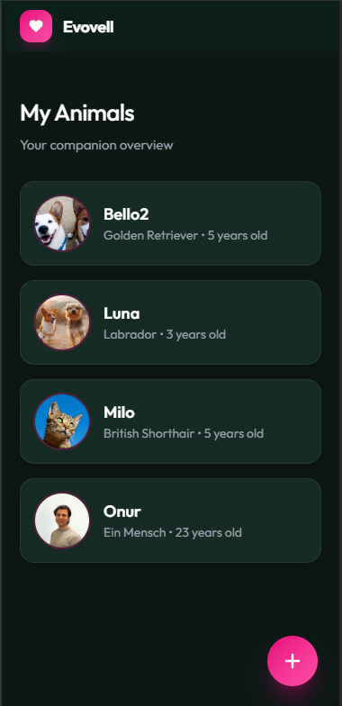
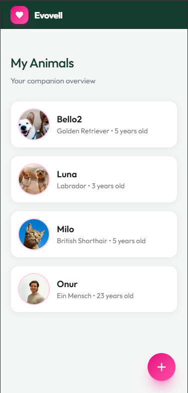
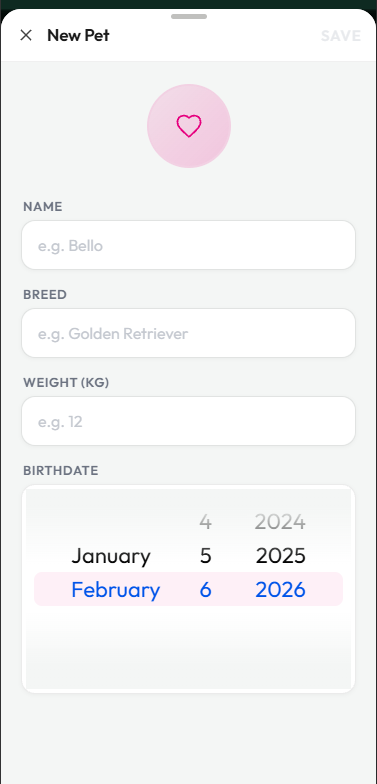

# Ionic Pet Management Demo

Eine kleine Demo-App zur Verwaltung von Haustieren, gebaut mit Ionic React und lokaler Browser-Speicherung.

## Was wurde gebaut?

Eine mobile-first Web-App zur Verwaltung von Haustierdaten mit folgenden Features:

- **Haustier-Verwaltung**: Übersicht aller Tiere mit Name, Rasse, Gewicht, Geburtsdatum und Foto
- **Formular zum Hinzufügen**: Modal mit Validierung für neue Tiere
- **Bild-Upload**: Unterstützung für Bild-Upload mit Base64-Konvertierung (Web-kompatibel)
- **Lokale Speicherung**: Verwendung von Ionic Storage (IndexedDB) für absolute Datensicherheit
- **Dark/Light Mode**: Automatische Anpassung an System-Präferenzen
- **Responsive Design**: Optimiert für Mobile und Desktop
- **Pre-filled Daten**: Demo-Daten (Bello, Luna, Milo) werden beim ersten Start geladen

## Screenshots

### Dark & Light Mode




### Formular Feature



## Warum wurde das gebaut?

Diese App entstand als Experiment, um Ionic zu testen und die Entwicklererfahrung zu evaluieren. Die Datenspeicherung wurde bewusst lokal im Browser implementiert, da dies für Testzwecke nicht nur am einfachsten war, sondern auch absolute Datensicherheit gewährleistet.

Das Design ist ein Mix zwischen Apple's Design-Sprache und den Evovell-Farben mit subtilen Animationen – inspiriert von der Evovell-Website.

## Technologie-Stack

- **Ionic React** 8.5.0
- **React** 19.0.0
- **TypeScript**
- **Tailwind CSS** 4.1.18
- **Ionic Storage** (IndexedDB)
- **Vite** als Build-Tool

## Was würde ich verbessern?

### Kurzfristig

- ✅ **Testing**: Unit-Tests für Forms und Validierung, Integration-Tests für Datenfluss
- ✅ **Löschen-Funktion**: Möglichkeit, Tierakten zu löschen

### Mittelfristig

- 🔄 **Native Apps**: Vollständige iOS/Android-Apps mit Capacitor
- 🔄 **Authentifizierung**: Login/Registrierung für Multi-User-Support
- 🔄 **Remote-Server**: Synchronisation mit Backend für Cloud-Backup
- 🔄 **Erweiterte Datenfelder**: Impfungen, Medikamente, Tierarztbesuche, etc.

### Langfristig

- 🔄 **Push-Notifications**: Erinnerungen für Impfungen, etc.
- 🔄 **Multi-Pet-Management**: Erweiterte Verwaltung für Tierärzte/Pensionen

## Entwicklung

```bash
# Dependencies installieren
npm install

# Development Server starten
ionic serve
```

## Hinweise

- Die App verwendet **lokale Browser-Speicherung** – Daten bleiben auf dem Gerät
- **Pre-filled Demo-Daten** werden beim ersten Start automatisch geladen
