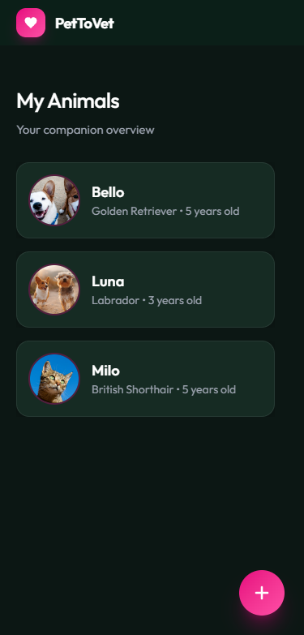
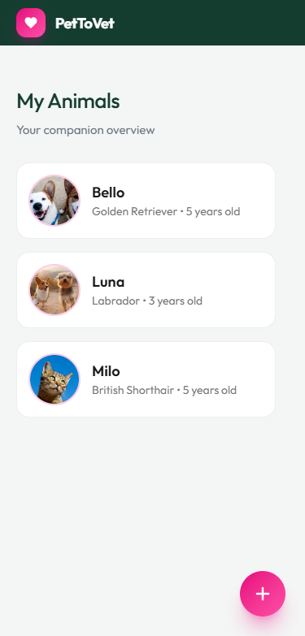
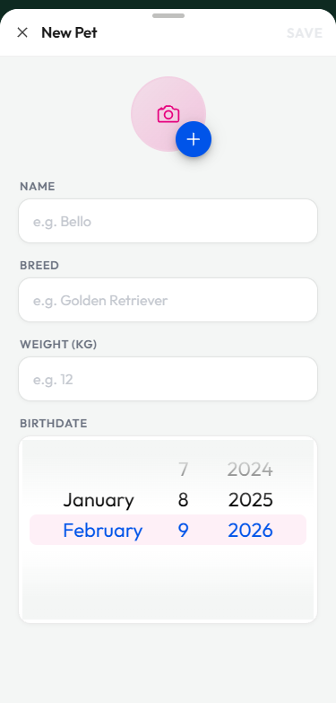
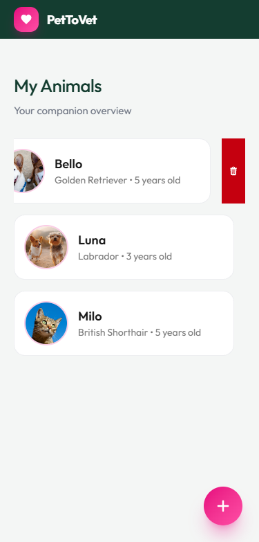
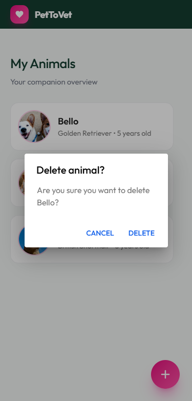
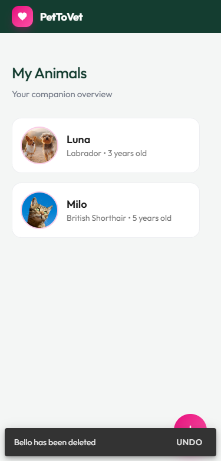

# Ionic Pet Management Demo

Eine kleine Demo-App zur Verwaltung von Haustieren, gebaut mit Ionic React und lokaler Browser-Speicherung.

## Was wurde gebaut?

Eine mobile-first Web-App zur Verwaltung von Haustierdaten mit folgenden Features:

- **Haustier-Verwaltung**: Übersicht und Management aller Tiere mit Name, Rasse, Gewicht, Geburtsdatum und Foto
- **Formular zum Hinzufügen**: Modal mit Validierung für neue Tiere
- **Bild-Upload**: Unterstützung für Bild-Upload mit Base64-Konvertierung (Web-kompatibel)
- **Lokale Speicherung**: Verwendung von Ionic Storage (IndexedDB) für absolute Datensicherheit
- **Dark/Light Mode**: Automatische Anpassung an System-Präferenzen
- **Responsive Design**: Optimiert für Mobile und Desktop
- **Pre-filled Daten**: Demo-Daten (Bello, Luna, Milo) werden beim ersten Start geladen

# Screenshots

## Dark & Light Mode




## Formular-Feature



## Delete-Flow (mit Verifikation)





Der Delete-Flow zeigt eine Verifikation: Erst per Swipe löschen, dann per Alert bestätigen, danach erscheint ein Toast.

## Warum wurde das gebaut?

Ich wollte Ionic mal testen und schauen, ob der Stack zu mir passt. Neben den Klausuren hatte ich leider nicht viel Zeit, also nur was Kleines. Insgesamt eine gute Erfahrung, mit den pre-styled Components muss ich erst noch Erfahrung sammeln.

Ich habe eine Pet-Management-App gebaut, weil das gerade gut zum Kontext gepasst hat.

## Technologie-Stack

- **Ionic React** 8.5.0
- **React** 19.0.0
- **TypeScript**
- **Tailwind CSS** 4.1.18
- **Ionic Storage** (IndexedDB)
- **Vite** als Build-Tool

## Was würde ich verbessern?

### Kurzfristig


- ✅ **Swiping**: Swipe-Delete ist noch etwas unschön
- ✅ **Testing**: Unit-Tests für Forms und Validierung, Integration-Tests für Datenfluss
- ✅ **iOS App**: Auseinandersetzen mit Capacitor, um iOS-fähig zu machen.

### Mittelfristig

- 🔄 **Authentifizierung**: Login/Registrierung für Multi-User-Support
- 🔄 **Remote-Server**: Synchronisation mit Backend für Cloud-Backup
- 🔄 **Erweiterte Datenfelder**: Impfungen, Medikamente, Tierarztbesuche, etc.

### Langfristig

- 🔄 **Push-Notifications**: Erinnerungen für Impfungen, etc.
- 🔄 **Multi-Pet-Management**: Erweiterte Verwaltung für Tierärzte/Pensionen

## Entwicklung

```bash
# Dependencies installieren
npm install

# Development Server starten
npm run dev
```

## Hinweise

- Die App verwendet **lokale Browser-Speicherung** – Daten bleiben auf dem Gerät
- **Pre-filled Demo-Daten** werden beim ersten Start automatisch geladen
